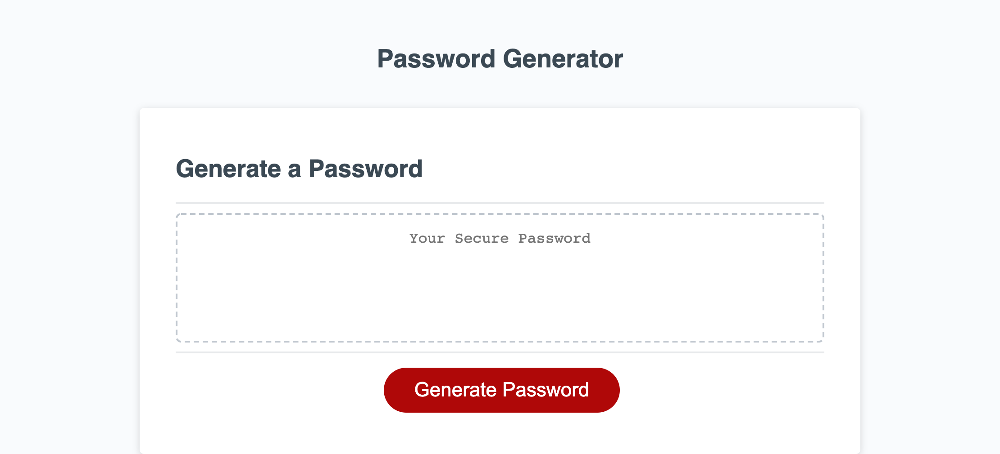

# Password Generator

## Description
This script generates a password with lowercase, uppercase, numeric and/or special characters in a random sequence by presenting a series of prompts to choose what a user would like their password to contain!

* After clicking the Generate Password button, the first prompt will ask what length the user would like for their password. (Note: The input must be numeric, be greater than or equal to 8, and be less than or equal to 128.)

* Once the length has been selected, a series of window.confirms ask what kind of character types the user would like to have in their password. (Note: If none of the character types are selected, the user will be alerted with a message requesting the user to select at least one character type to generate password, then be brought back to the password length prompt.)

* When all prompts are answered accordingly, the password is generated and written on the page!

## URL Link and mock-up

* [URL of deployed application]

* [URL of repo]

* [SSH of repo]
(git@github.com:Chis517/password-generator.git)

* [Screenshot of deployed application]
